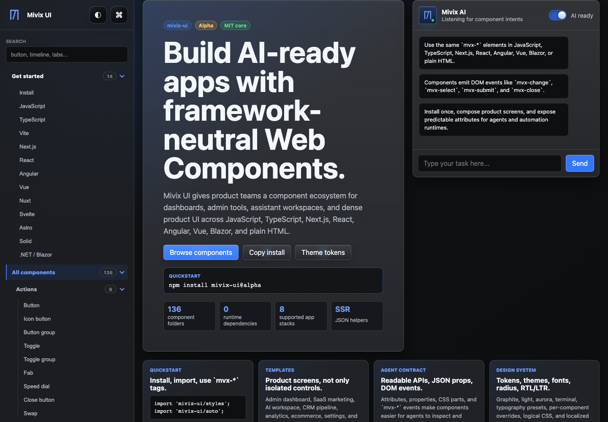
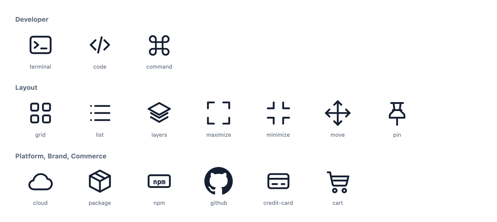
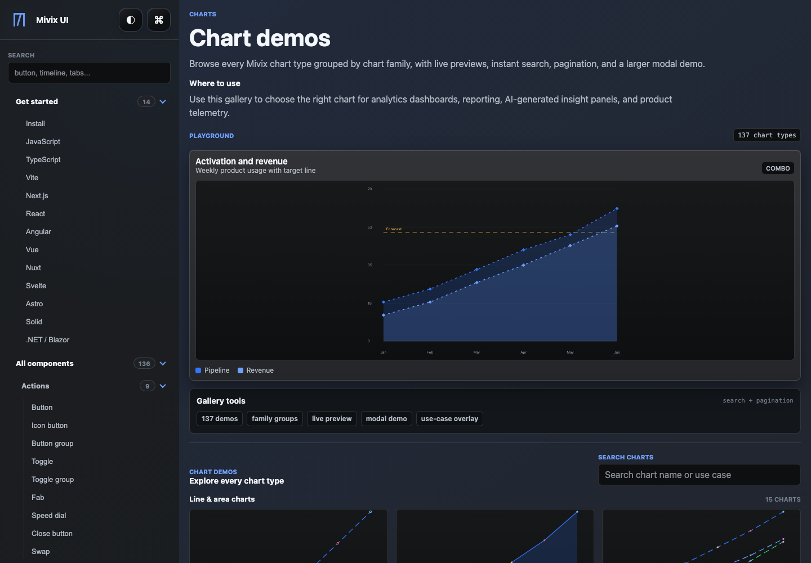
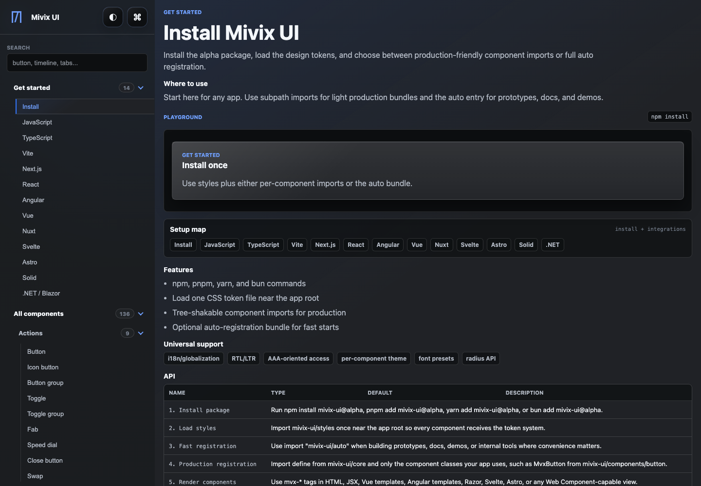

# Mivix UI

[](LICENSE)
[](https://devduocouple.github.io/mivix-ui/)


Mivix UI is a responsive, web-component-first toolkit for AI-ready dashboards and workflow interfaces.

## Table of contents

- [Quick start](#quick-start)
- [Status](#status)
- [What’s included](#whats-included)
- [Showcase](#showcase)
- [Documentation](#documentation)
- [Bugs and feature requests](#bugs-and-feature-requests)
- [Contributing](#contributing)
- [Versioning](#versioning)
- [License](#license)

## Quick start

Install the current alpha channel:

```bash
npm install mivix-ui@alpha
```

Use exact imports for small bundles:

```ts
import 'mivix-ui/styles';
import { MvxButton } from 'mivix-ui/components/button';
import { MvxInput } from 'mivix-ui/components/input';
import { define } from 'mivix-ui/core';

define('mvx-button', MvxButton);
define('mvx-input', MvxInput);
```

```html
<mvx-input label="Project name"></mvx-input>
<mvx-button type="solid" tone="primary">Create</mvx-button>
```

## Status

**Alpha**

`mivix-ui` is still evolving before beta. API signatures may change, and we intentionally keep this package lightweight while we stabilize core primitives, charts, and AI surfaces.

## What’s included

- **Core package**: tree-shakable component entrypoints in `mivix-ui/components/*`
- **Auto registration**: `mivix-ui/auto`
- **Theming**: token-based themes, directionality, and locale options
- **Frameworks**: React, Next.js, Angular, Vue, Blazor, and plain JS/TS support
- **Dashboard primitives**: controls, charts, panels, navigation, and AI-oriented surfaces

## Showcase









## Documentation

- Docs site: https://devduocouple.github.io/mivix-ui/

## Bugs and feature requests

If you find a bug or want a new feature, please open an issue:

- https://github.com/devduocouple/mivix-ui/issues

## Contributing

Contribution guidance:

- [CONTRIBUTING.md](./CONTRIBUTING.md)
- [Roadmap](./ROADMAP.md)
- [Phase 1 release audit](./PHASE-1-RELEASE-AUDIT.md)

For publish/release process and token flow, see:

- [RELEASE.md](./RELEASE.md)

## Versioning

Mivix UI follows Semantic Versioning.

- Current channel: `alpha`
- Recommended install: `npm install mivix-ui@alpha`
- Current release target: `0.1.0-alpha.3`
- Legacy `0.1.0-alpha.0` is no longer referenced in active docs.

## License

MIT — see [LICENSE](./LICENSE).
